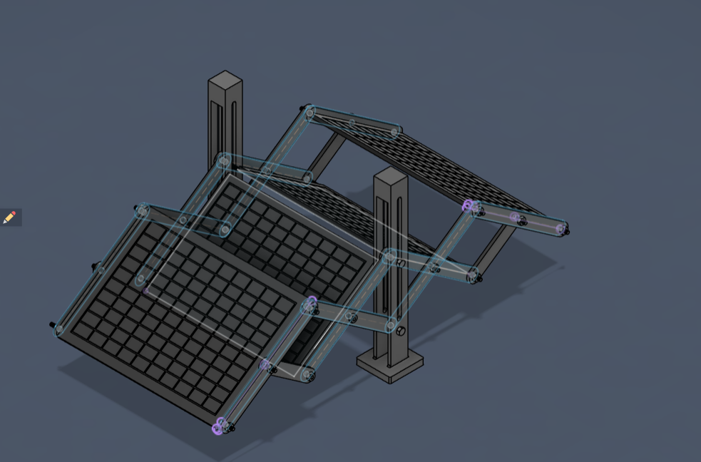
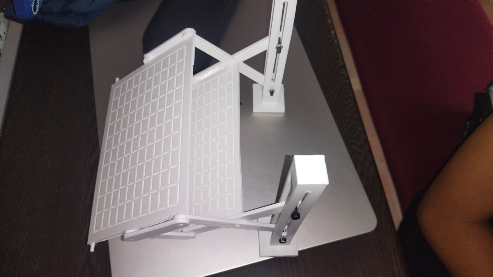

# Expandable Solar Panel System

## Project Overview
A compact solar panel system that uses a parallelogram linkage mechanism to smoothly expand and retract the panel array while maintaining proper alignment. The design improves portability, reduces storage space, and enables efficient deployment for mobile and space-constrained applications.

## Features
* **Parallelogram Linkage Mechanism**: Ensures smooth expansion and retraction while keeping panels perfectly aligned.
* **Space-Optimized Design**: Compact footprint reduces storage space when folded.
* **Highly Portable**: Ideal for mobile deployment and space-constrained environments.
* **Rapid Deployment**: Quick setup and retraction process.

##  Hardware & Components
* 3D Printed custom linkages and mechanical mounts
* [Placeholder: List fasteners, e.g., M3 screws, nuts]
* [Placeholder: Specify solar panel model/type used]

##  Software & Tools
* **CAD Software**: Used for designing the 3D model (STEP file available in `cad/` folder).
* **3D Printing Slicing Software**: For manufacturing the physical prototype.

## 📁 Repository Structure
```
Expandable-Solar-Panel/
│
├── README.md          # Project documentation
├── .gitignore         # Ignored files and folders
│
├── cad/               # 3D models and part files (STEP)
│   ├── expandable-solar-panel.step
│   ├── Bolt.step
│   ├── Nut.step
│   ├── panelbig v1.step
│   ├── slot180 .step
│   └── slot90 .step
└── images/            # Project photos and renders
    ├── 3d-model-render.png
    └── 3d-printed-prototype.jpeg
```

## 🚀 Setup & Usage
1. **CAD Files**: The 3D model is provided in the `cad/` directory as a `.step` file. You can open this in any standard CAD software (Fusion 360, SolidWorks, Inventor, etc.) to view or modify the design.
2. **Fabrication**: The components shown in the `images/` directory can be 3D printed using standard FDM/SLA printers.
3. [Placeholder: Add instructions for assembly or deployment if needed]

## 📸 Project Images

### 3D Model Render


### 3D Printed Prototype


## 🔮 Future Improvements
* [Placeholder: Add future scope, e.g., Motorized actuation, sensor integration for sun tracking, etc.]

---
*This repository was created as part of a student engineering project.*
